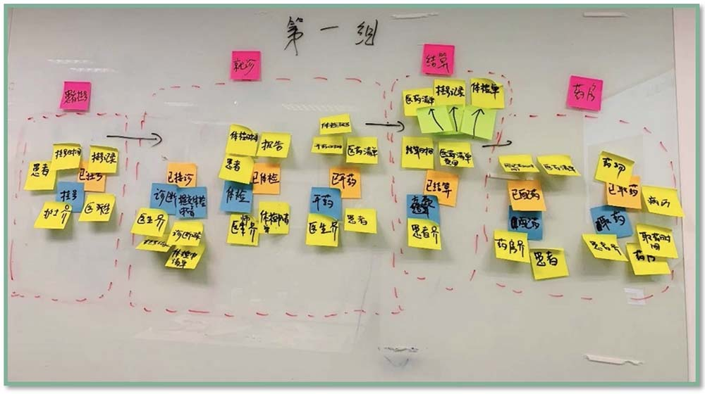

# hi-DDD

> leaning DDD
>
> 最近有个国际贸易项目，都是专业中英文术语，正好试一试。

## 统一语言建模

<h6 style="color: orange; text-align: center;">研发不懂客户、客户也不懂研发</h6>

- 我主动学习你的语言，了解你的业务领域知识并用你的语言与你沟通；
- 我主动地让你了解我的语言，了解我的业务领域知识，并用我的语言与你沟通；

### 事件风暴

> [Event Strom]
>
> **一种基于工作坊的DDD实践方法，可以快速发现业务领域中正在发生的事件，指导领域建模及程序开发。**

事件即事实，即在业务领域中那些已经发生的事件就是事实(Fact)。

### 召开事件风暴会议

> 在产品经理的引导下，与业务专家梳理当前的业务中有哪些领域事件。

- 什么是领域事件？
  - 即已经发生，并需要保存下来的事实。
  - 在命名的时候应当采用 **`过去时态`**

- DDD 往往用于系统增删改(`没有查`)的业务场景中
- 针对每个领域事件，项目组成员围绕它进行业务分析，增加各种命令与事件，进而思考与之相关的资料、外部系统与时间
